# Fiche Palmares - Réseau Vivant

## 1. Symbiose
:  Réalisé par Yannick Chamberland, Benjamin Ferlin, Ryan Dufault et Walid Cheour.

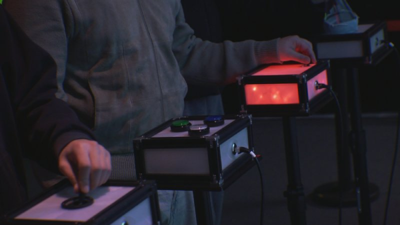

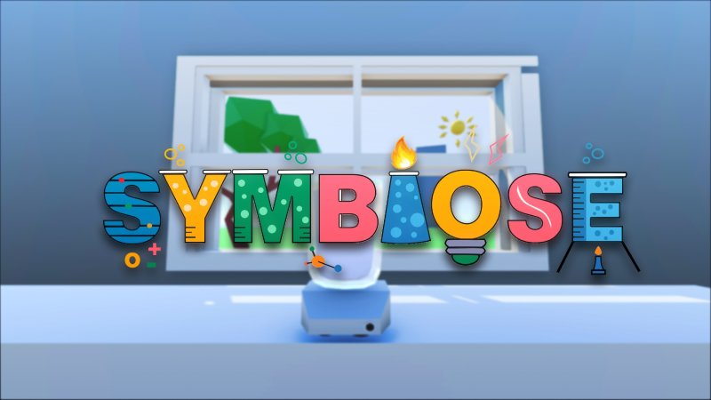

### Schéma d'installation

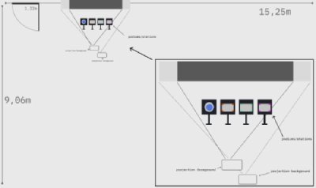

### Mon expérience

Avant d'essayer, j'étais déjà plutôt intéressé parce que les cris de joie et de défaite que j'entendais m'intriguaient et aussi, à première vue, le jeu avait l'air stressant. Après l'avoir essayé, j'aime bien le dispositif. C'est une course contre la montre qui réveille du défi, ce qui stimule.

## 2. Mission Décollage
: Réalisé par Ahmed Kaissoumi, Radhouane Kordan, Justin Montpetit, Thearylou Lach et Jad Saloumi.

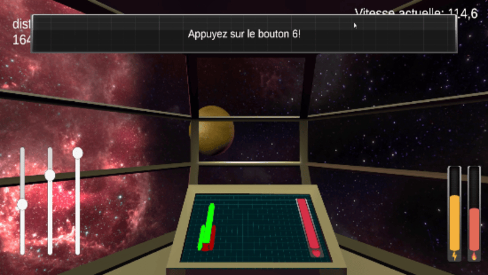

### Schéma d'installation

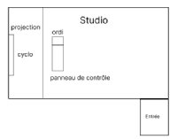

### Mon expérience

À première vue, le dispositif m'a paru banal malgré le fait qu'il se passe dans l'espace et le nombre de joueurs que ça prend. Cependant, après que je l'aie essayé, je dirais que le gameplay est fluide et, comme dans le dispositif précédent, il y a ce sentiment d'urgence qui rend l'expérience encore plus intense. Mais, la raison pour laquelle je ne l'ai pas placé plus haut est parce que je pense qu'il y a un peu trop de boutons qui se ressemble et/ou que leur fonctions est vague.

## 3. Arbre en face
: Réalisé par Alexandre Gendron, Mikael Arseneau, Mathieu Willet, Matis Ghariani et Rafael Angon Dube.

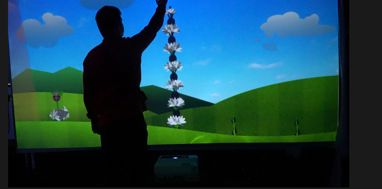

### Schéma d'installation

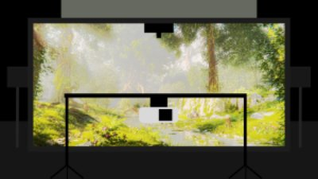

### Mon expérience

Arbre en face est à la troisième position, car même si j'apprécie l'approche et l'idée derrière, la version finale est, je trouve, répétitive. Il n'y a pas assez de choses à faire qui pourraient garder l'intérêt de celui ou celle qui essaye.

## 4. Quand les yeux se croisent 
: Réalisé par Edelwyne Ledru, Félix Lavoie, Jade Hébert, Manel Yaya et Patricia Nassif. 

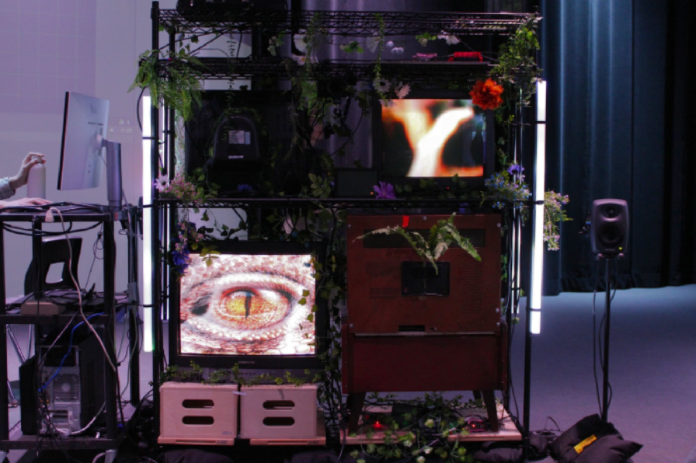

### Schéma d'installation

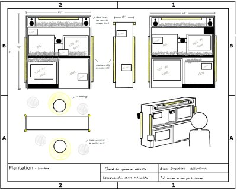

### Mon expérience

Je l'ai placé ici parce que le dispositif a une belle idée derrière et le message aussi entourant la similarité des humains avec les animaux, avec la nature, cependant le dispositif lui-même est un peu trop simple. C'est un dispositif qui attire l'attention que pendant quelques secondes avant que ça devienne répétitif.

## 5. Océan Rouge
: Amira Tounekti, Kisty Moussally.

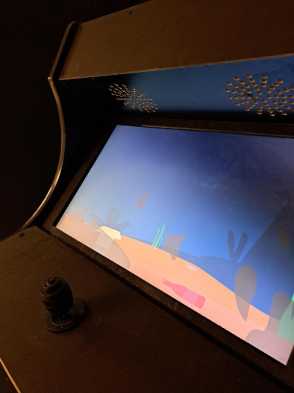

### Schéma d'installation

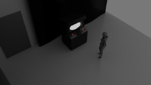

### Mon expérience

Il est dernier de la liste à cause de la version finale. L'écran du dispositif a considérablement rétréci, ce qui est devenu complexe à bien observer. Il y a aussi le fait que les mouvements sont aussi devenus limités à cause de ça. De plus, ça n'aide pas que le dispositif à la base n'a pas un système qui stimule, encourage le joueur à continuer, mais j'adore le message vehiculé. 

## Cours nécessaires
- Programmation
- Animation 3d
- Modélation 3d

# Références

[photos symbiose](https://les-chimistes.github.io/symbiose/#/presse) + [schéma symbiose](https://les-chimistes.github.io/symbiose/#/technique/) 

[photo Mission Décollage](https://o-i-g-n-o-n.github.io/Mission-decollage/#/presse/) + [schéma Mission Décollage](https://o-i-g-n-o-n.github.io/Mission-decollage/#/technique/) 

[photo Arbre en face](https://mammouths.github.io/projet/#/presse/) + [schéma Arbre en face](https://mammouths.github.io/projet/#/technique/) 

[photo Quand les yeux se croisent](https://emersiaa.github.io/Quand-les-yeux-se-croisent/#/dossier_presse/) + [schéma Quand les yeux se croisent](https://emersiaa.github.io/Quand-les-yeux-se-croisent/#/technique/)

[photo Océan Rouge ](https://deux-intelligence.github.io/deux-neurones/#/presse/) + [schéma Océan Rouge ](https://deux-intelligence.github.io/deux-neurones/#/technique/) 
