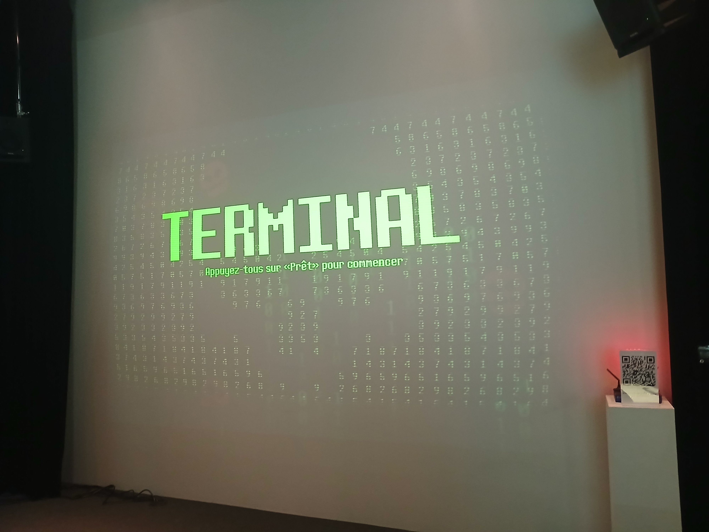
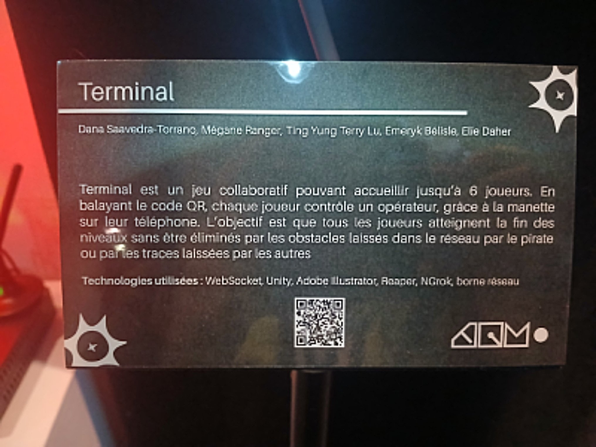
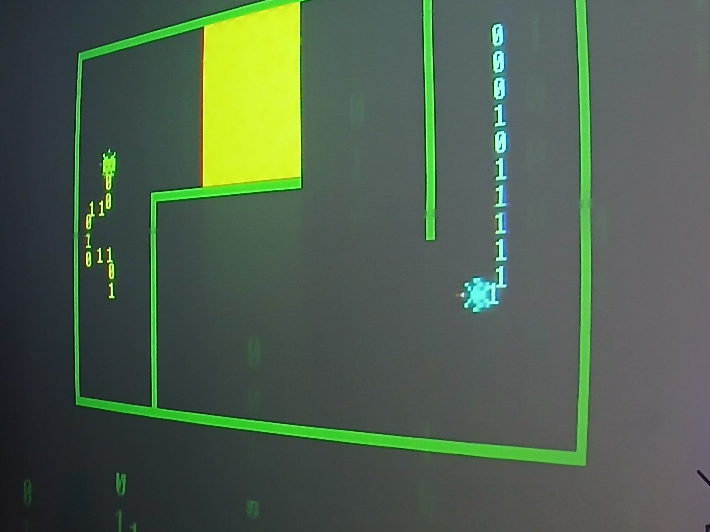
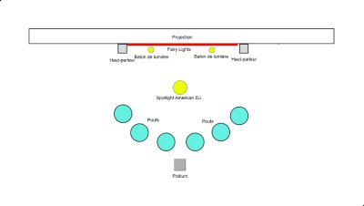
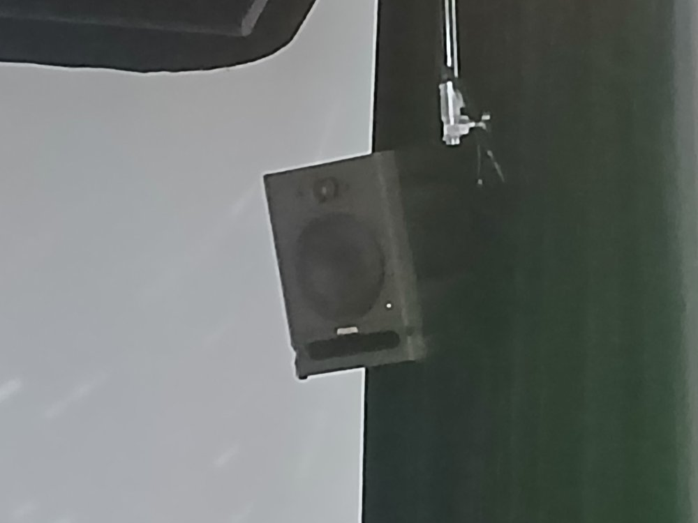
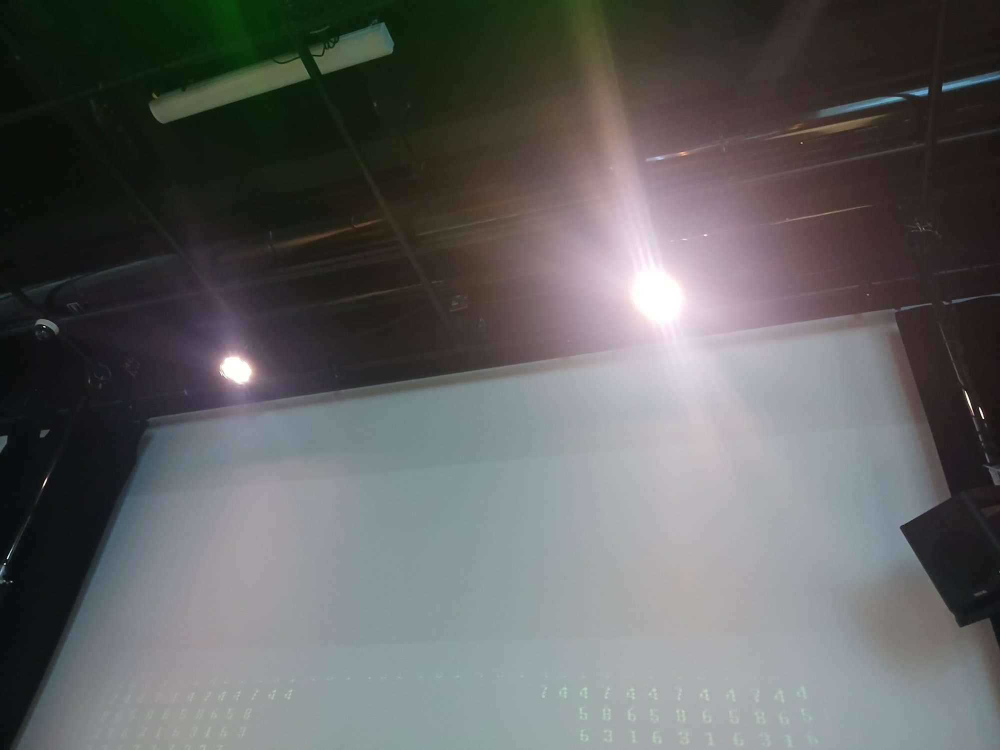
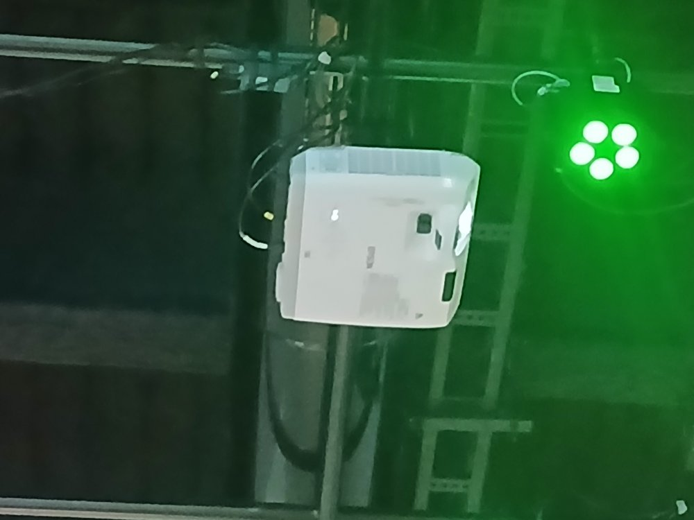
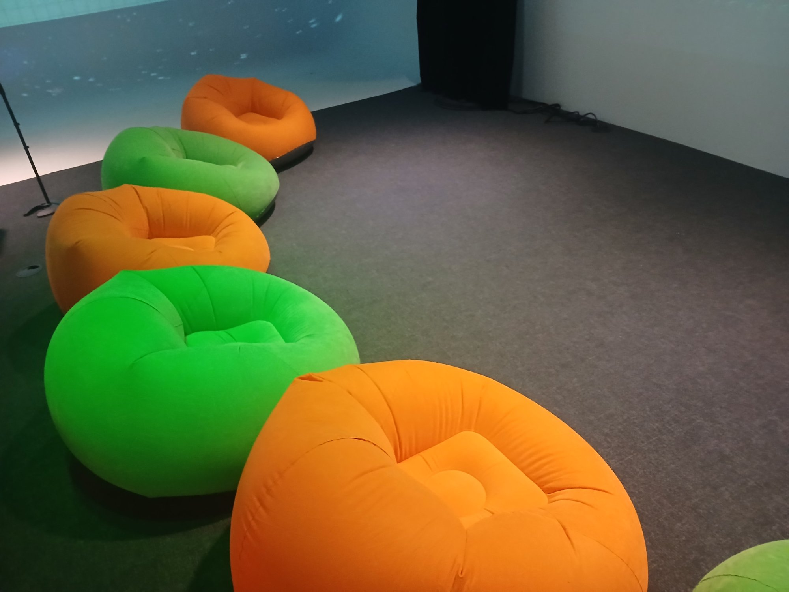

# Réseau Vivant 2026

## Lieu de l'exposition
Collège Montmorency

### Type d'exposition
Permanente et intérieure

### Date de visite 

Le 24 Février.

## Terminal

### Artistes
- Émeryk Bélisle
- Elie Daher
- Ting Yung Lu Terry
- Dana Saavedra-Torrano
-  Mégane Ranger
-  
### Année de réalisation
En 2026

## Description de l'oeuvre
TERMINAL est un jeu collaboratif pouvant accueillir jusqu’à 6 joueurs. Chaque joueur contrôle un opérateur, grâce à la manette sur leur téléphone, qui essaie de trouver l'accès au vieux réseau internet afin de restaurer les données qui ont été corrompues par une cyberattaque orchestrée par un fameux pirate informatique. Lorsque les joueurs vont se déplacer, une ligne suit leur trajectoire et devient un obstacle pour les autres opérateurs. L’objectif est que tous les joueurs atteignent la fin des niveaux sans être éliminés par les obstacles laissés dans le réseau par le pirate ou par les traces laissées par les autres. En cas d’élimination, tous les joueurs doivent recommencer le niveau depuis le début. Au fur et à mesure de la progression, les niveaux deviennent de plus en plus complexes, introduisant par exemple des boutons qui ouvrent des passages pour les autres, des obstacles mobiles et bien plus encore.

### Type d'installation
Intéractive

## Fonction du dispositif multimédia

Un support pédagogique qui sert, d'une façon amusante de subtilement d'apprendre à travailler ensemble.

## Mise en espace

## Composantes et techniques
- Ordinateur principal sur chariot (1): PC de contrôle exécutant Unity, gère le jeu, les connexions et la projection.

   

- Projecteur (1): Projection murale grand format pour afficher la zone de jeu commune.

- Tablettes / phones (1-6): Contrôleurs utilisés par les joueurs (connexion Wi-Fi).

- Routeur Wi-Fi (1): Permet la connexion des téléphones si le jeu est accessible via navigateur mobile.

- Haut-parleurs amplifiés (2): Diffusion stéréo des sons du jeu pour renforcer l’immersion collective.

- Sender / Receiver (1 chaque): Permet de connecter le cable video de l'ordinateur vers le projecteur.

- Cables Ethernet (3 à 4): Connectez les matériaux à l'internet

- Câbles vidéo (1): HDMI ou DisplayPort reliant le PC au projecteur.

- Câbles audio (2): XLR pour relier la sortie audio aux haut-parleurs.

- Câbles d’alimentation: Selon les haut-parleurs et le projecteur.

- Multiprise / rallonge électrique – Pour alimenter l’ensemble du système.

- Lumière plafond American DJ

- Lumière Baton (2-4): Mettre de la lumière d'ambiance qui change avec une donné en boucle

- Boite de lumière (1): Permet de brancher les lumière en daisy chain et les reliers à l'ordinateur

- Ralonges pour lumières (2-4) Brancher les lumières mêmes si elles sont loins l'une et l'autre

- Power supply pour boite à lumière: Donner le power à la boite à lumières

-Boules de connections de lumières (2): Faire tenir les lumières droites

- Carte graphique extérieur (1): Pour projeter les données vers les couleurs de lumières

## Éléments nécessaires à la mise en exposition
- Pouf gonflable

- Podium code Qr
- Fairy Lights
- Abonnement NGrok 2 mois

### Expérience vécue

Je me suis assise dans un pool et j'ai pris mon téléphone, puis je me suis connectée au jeu. La partie commence avec plusieurs joueurs et nous devons tous toucher un carré vert, et il ne faut pas se toucher. Je me suis touché moi-même dans le jeu plusieurs fois, ce qui a fait qu'on a  perdu beaucoup de fois.

### ❤️ Ce qui vous a plu, vous a donné des idées

J'ai aimé presque tout. La musique de fond, le vibe du jeu, le fait qu'il faut à tout prix collaborer, la prudence nécessaire pour se déplacer, le sentiment d'accomplissement et de soulagement après avoir gagné une manche, etc. Le seul bémol est le fait que les niveaux changent que quand un joueur quitte la partie.

### 🤔 Aspect que vous ne souhaiteriez pas retenir pour vos propres créations ou que vous feriez autrement

Le fait que le niveau ne peut que changer si un joueur quitte.

## Références

[informations sur composantes et techniques + Éléments nécessaires à la mise en exposition](https://pythons-5.github.io/Terminal/#/technique/)

[Description de l'oeuvre](https://pythons-5.github.io/Terminal/#/)

[Artistes](https://pythons-5.github.io/Terminal/#/equipe/)

Photos prises par moi, Tanya Mariella Koffi.
