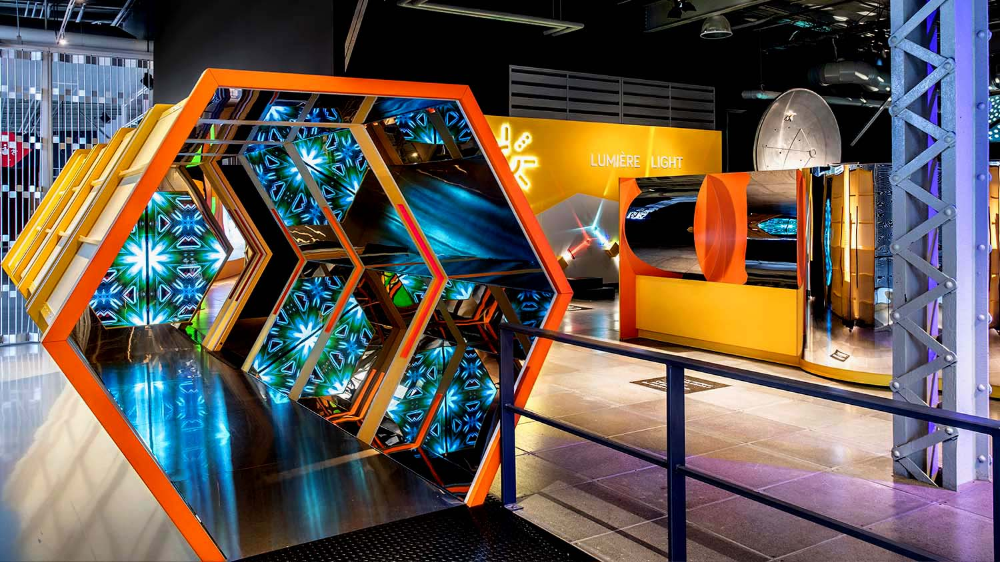
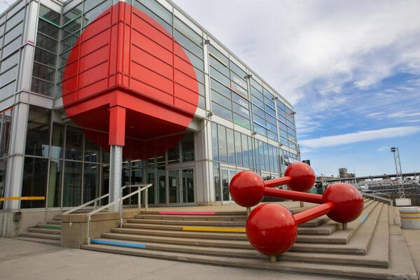
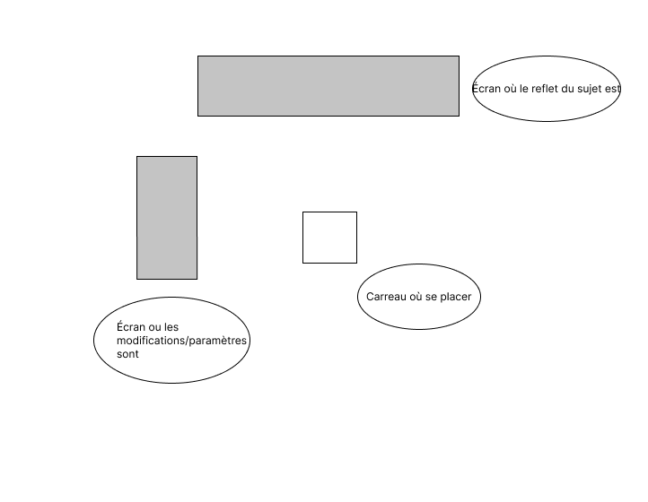

# **La science en grand**

## Lieu de l'exposition

### Type d'exposition
Permanente et intérieure.

## Date de la visite
Le mercredi 1er Avril 2026.

## Titre de l'oeuvre
*L'intelligence Artificielle de Element Ai*

## Nom de l'artiste
**Element Ai**

## Année de réalisation
En 2026.

## Description de l'oeuvre

Le dispositif possède deux écrans. Un est pour les réglages des divers modes et l'autre est pour l'affichage / résultat du changement de mode sur les personnes qui se placent devant.

## Type d'installation
L'installation est interactive. Il faut changer les modes pour voir différents changements.

## Fonction du dispositif multimédia
Sa fonction est d'explorer comment, avec simplement de l'IA, on peut distorde la caméra.

## Mise en espace

## Composantes et techniques

1. 1 écran qui illustre le sujet et les changements apportés sur l'image
3. Un autre écran qui présente les paramètres qu'on peut jouer avec
   

## Éléments nécessaires à la mise en exposition
1. Carreau orange au milieu du dispositif afin que l'écran puisse bien voir le sujet
2. Panneau 

## Mon expérience vécue
Je me suis mise sur le carreau et je me suis vue sur l'écran. Il y avait déjà un mode appliqué sur l'image. J'ai changé de mode et ça a fait que l'image sur l'écran de moi était noir et blanc.

## Ce qui m'a plu et donner des idées
Ce qui m'a plu, c'est le fait qu'il y a beaucoup de modes accessibles, ainsi ça garde l'intérêt. Aussi, j'aime bien aussi comment le deuxième /cran de paramètre est facile à utiliser.  Cependant, ce que je ferais autrement serait de rajouter des sections de modes avec plusieurs thèmes.
### Références

[Photo de science en grand](https://www.centredessciencesdemontreal.com/exposition-permanente/explore)
[Photo de centre des sciences de Montréal](https://www.centredessciencesdemontreal.com/sites/default/files/styles/facebook/public/2025-05/evenement-25-ans-centre-des-sciences-montreal-2025-_12a4516-photo.jpg?itok=wtLNEnD-)

