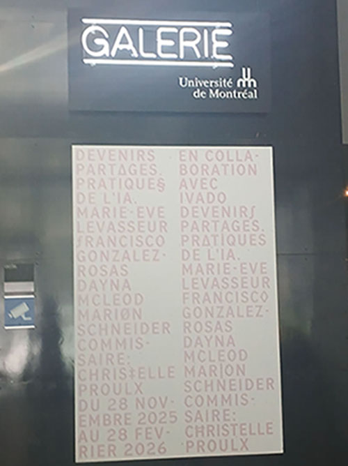
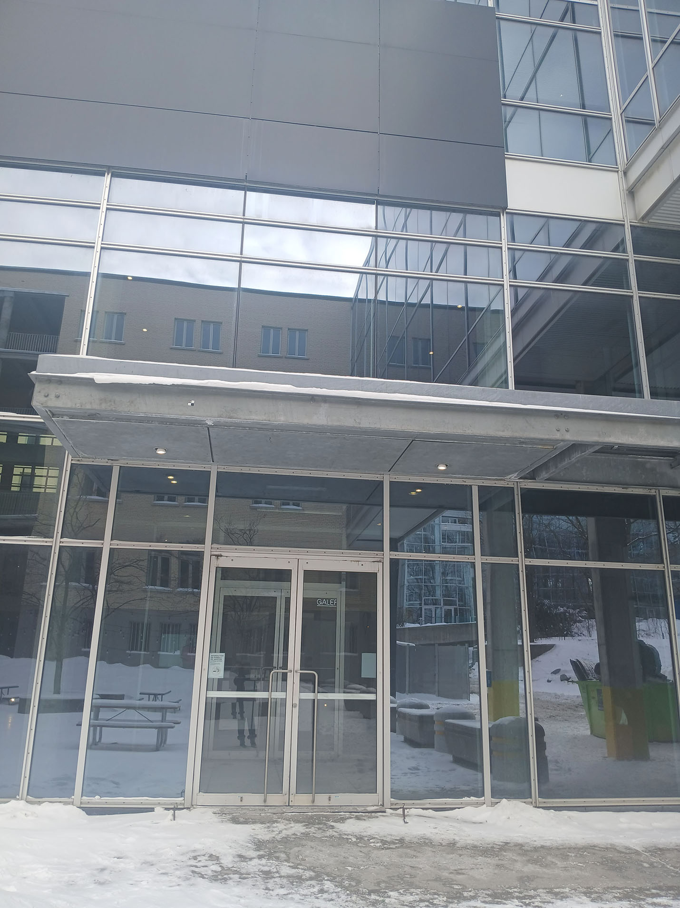
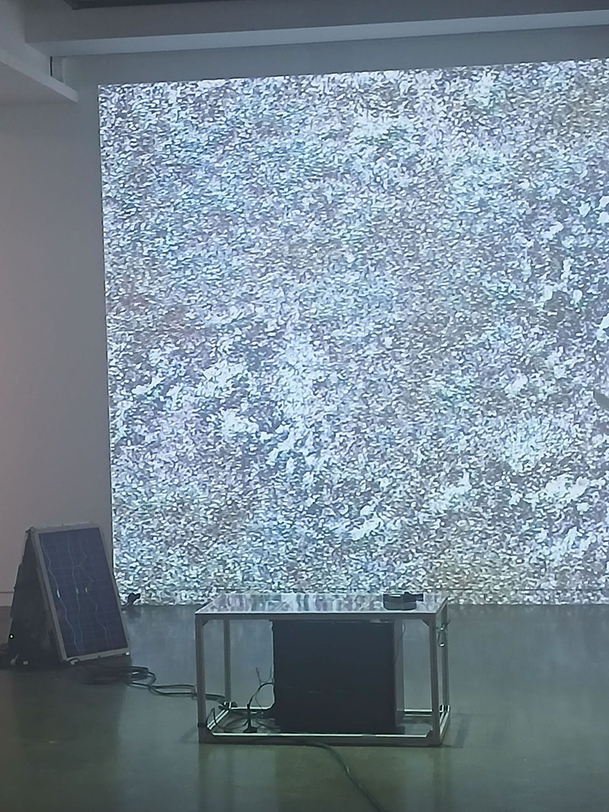
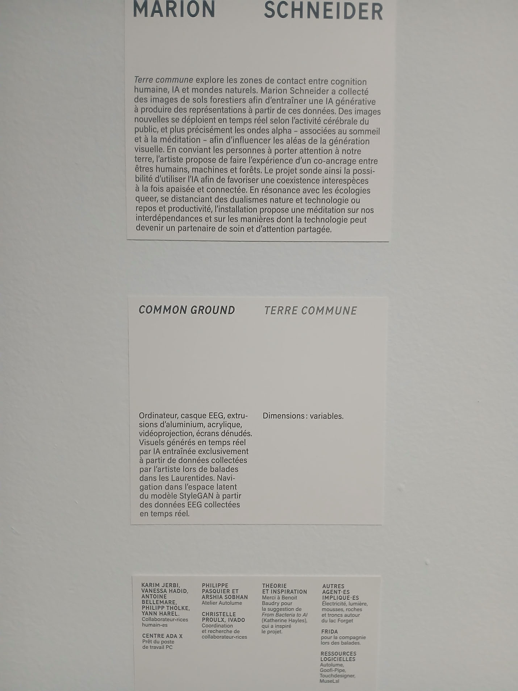
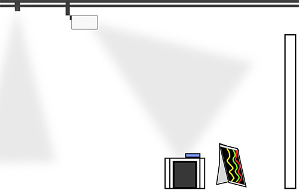
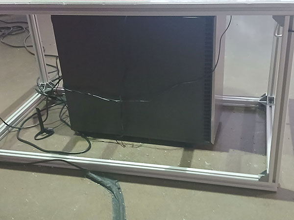
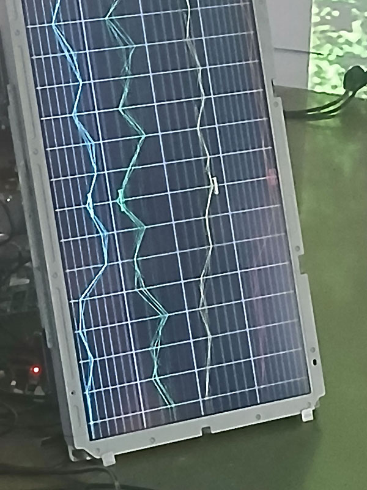
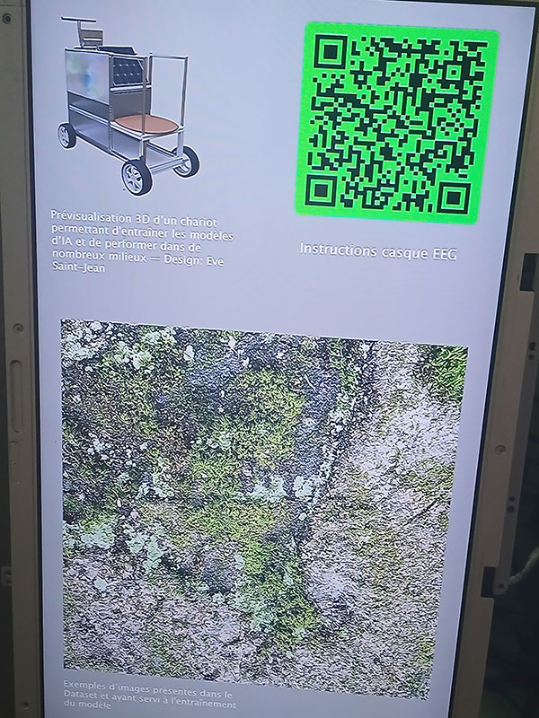
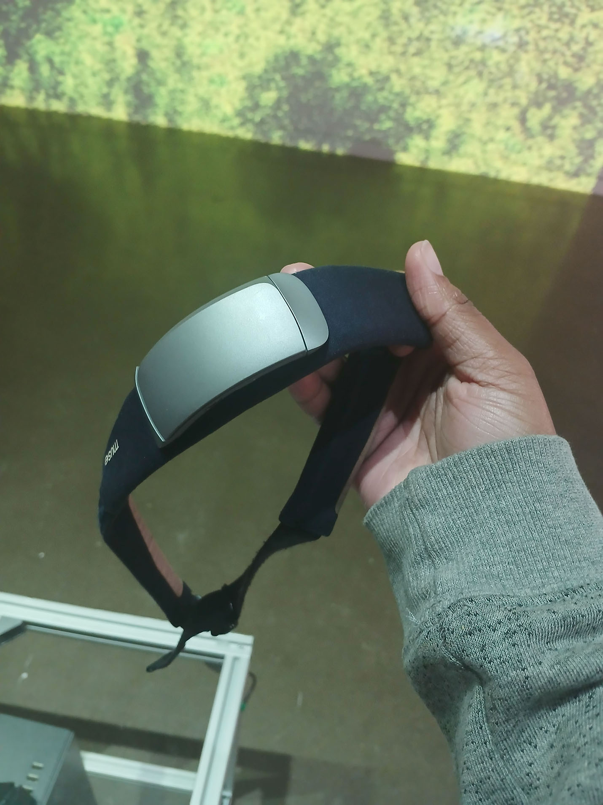
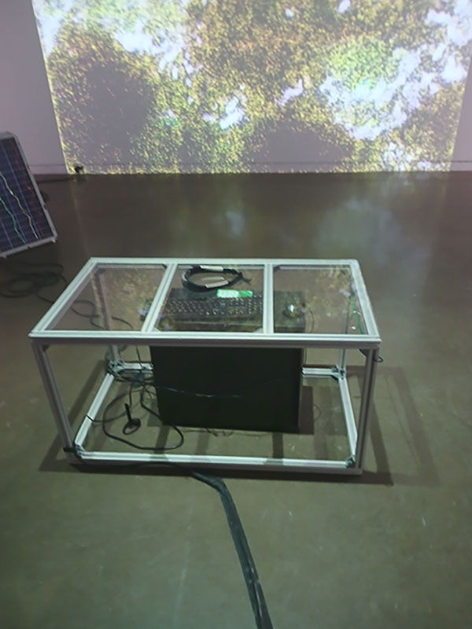

# **Devenir Partagés. Pratiques de l'IA**

## Lieu de l'exposition

## Type d'exposition
L'exposition est temporaire et intérieure.

## Date de la visite
Le vendredi 30 janvier 2026.

## Titre de l'oeuvre
*Common ground* ou Terre commune en français.

## Nom de l'artiste
**Marion Schneider**

## Année de réalisation
En 2025.

## Description de l'oeuvre

L'oeuvre marche avec l'activité cérébrale d'une personne à l'aide d'ondes. Il faut mettre un genre de bandeau sur son front.Le bandeau va détecter les activités cérébrales.

## type d'installation
L'installation est intéractive. Il faut regarder mais aussi porter le bandeau afin de voir un résultat sinon rien s'affichera sur le moniteur.

## Fonction du dispositif multimédia
Ça fonction est d'explorer la cognitive humaine, IA et le monde extérieur avec une IA générative pour la méditation et comment la technologie peut nous aider.

## Mise en espace

## Composantes et techniques

1. Image exposé
2. 1 écran qui illustre l'activité cérébrale avec des lignes colorées
3. Un aute écran qui présente des image venant de la database
4. Ordinateur

## Éléments nécessaires à la mise en exposition
1. Table en verre
2. Bandeau
3. Ordinateur
4. Fils
5. Projecteur
6. Mur blanc
## Mon expérience vécue
Je me suis assise sur la table en verre et mis le bandeau autour de ma tête. Rapidement, j'ai remarqué que sur l'écran où il y avait les lignes, elles ont commencer à se calmer en même temps que j'essayait de rester calme et de ne penser à rien. Après quelques minute, je me suis levé et mis le bandeau sur la table où je l'avait ramasser.

 
## Ce qui m'a plu et donner des idées
Ce qui m'a plu c'est le fait que les lignes bougeait selon ce qu'elles détectait comme activités qui se passait dand ma tête. Aussi, j'aime bien l'image qui est dans le deuxième moniteur. Le fait qu'elle change est très intéressant et intiguant. Cependant, ce que je ferais autrement, serait de changer l'image fixe qui est exposé en une vidéo qui bouge, qui attire le regard plus parce que l'image qu'ils ont exposé n'était pas vraiment attrayant.
### Références
[Galerie Université de Montréal](https://galerie.umontreal.ca/)
Photos et croquis prises par moi, Tanya Mariella Koffi.
