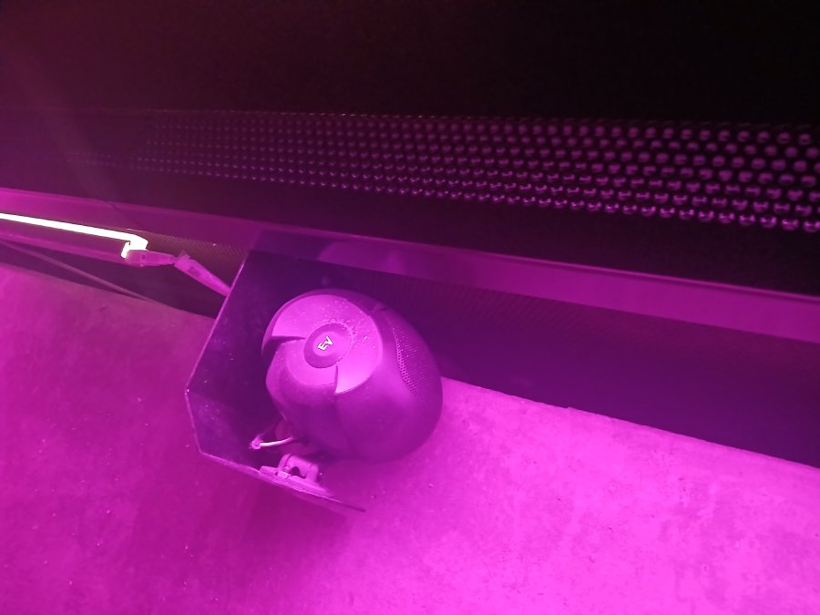
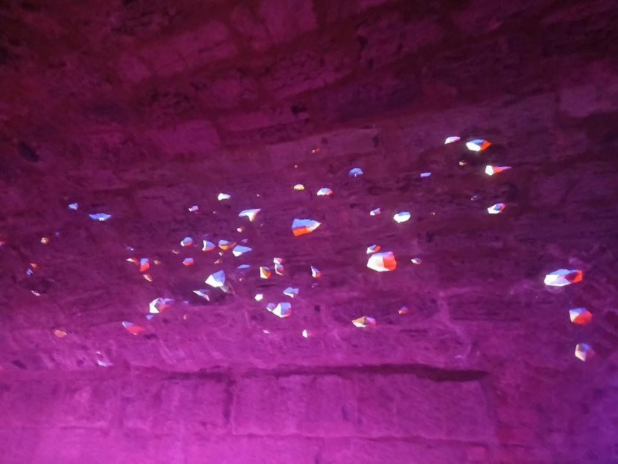
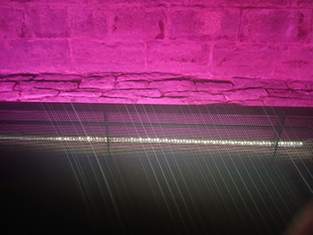
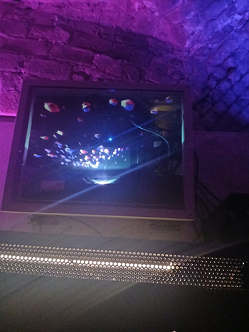

# Collecteur de mémoires
## Point à callière

> Type d'exposition : permanente et intérieure.
### Date de visite
Le 21 février 2026.

## Titre de l'oeuvre
Le premier égout collecteur.

### Firme et année de réalisation
L'installation a été créée le 17 mai 2017 pour le 375e anniversaire de Montréal et la firme qui l'a créée est Moment Factory, mais l'égout-même existe depuis les années 1800'.

### Description du dispositif

Le premier égout collecteur est une installation visant à mettre en valeur ce grand égout qui a été construit entre 1832 et 1838. Auparavant, il a servi à la canalisation des eaux de la Petite rivière, puis a filtré l'eau d'une autre rivière.

Type d'installation : Elle est contemplative et un peu immersive. On ne peut qu'observer, rien toucher, mais  il y a quand même une atmosphère établie.

## Fonction du dispositif multimédia 
La fonction de cette oeuvre est vraiment la mise en valeur. L'intention derrière cette installation est de dévoiler au public une infrastructure historique qui servait à l'époque, rien de plus.

## Croquis

-

## Composantes et techniques
  

 

 

- Système d'éclairage LED
- Audio Spatialisé
- Projecteurs (14)

## Éléments nécessaires à la mise en exposition
1. La structure métallique en bas, qui donne une meilleure façon d'accéder et marcher à travers l'égout, et en même temps protège le sol original.
2. Les câbles sont bien dissimulés afin que l'expérience soit pleine et parfaite.
3. Le système de ventilation qui empêche l'humidité de gâcher l'expérience.
4. Le téléviseur qui aide à la projection.

## Expérience vécue
Cette expérience a été très intrigante, ce qui est la raison pour laquelle je l'ai choisie. Dès que je suis rentré dans l'installation, plusieurs détails ont attiré mes yeux : les lumières LED, les quelques projections, d'autres passages de de l'égout qui me faisaient me poser plusieurs questions comme, ça ressemble à quoi là-dedans et etc.

### Ce qui m'a plu
Ce que j'ai bien plu était l'ambiance. On dirait vraiment que j'étais dans un égout fonctionnel. Aussi, l'égout avait l'air intact et ça a piqué encore plus ma curiosité. Je trouve qu'ils ont bien fait de garder l'apparence initiale de l'égout et de l'avoir parfaitement conservée, et c'est impressionnant à mon avis.

## Aspect que je ne souhaite pas retenir
Je pense qu'un aspect que je ne souhaite retenir est le manque d'information sur l'égout. Quand je suis allée, j'attendais à ce qu'il y ait un cartel où son histoire serait racontée. Malheureusement, rien et j'ai dû consulter la page du musée afin de trouver cette information. Ce que je pense est dommage.

# Références 
- [Point à callière photo](https://www.tourbytransit.com/montreal/things-to-do/Museum-of-Archaeology-and-History)
- [informations sur l'égout](https://pacmusee.qc.ca/fr/expositions/detail/collecteur-de-memoires/)
