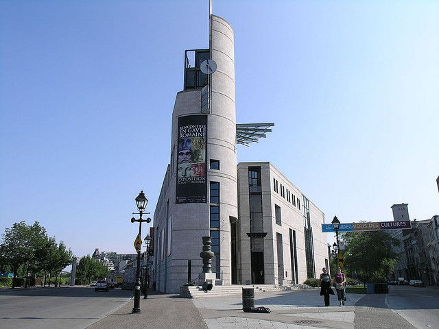
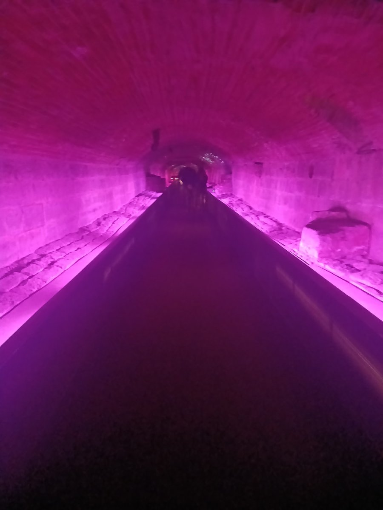
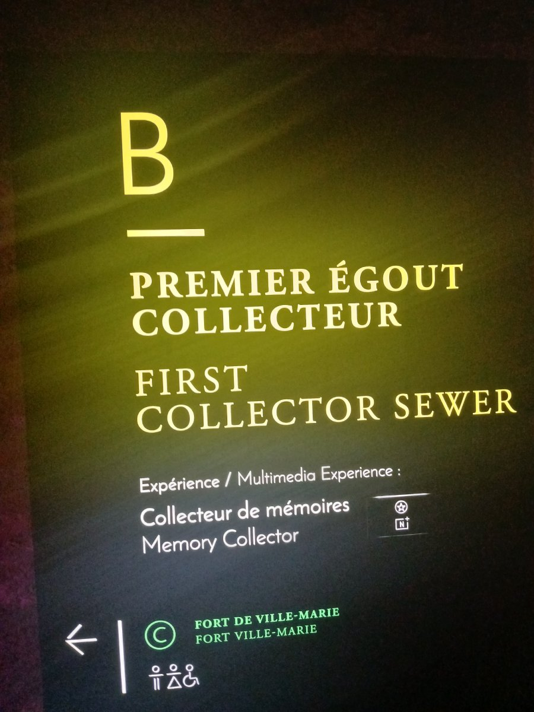
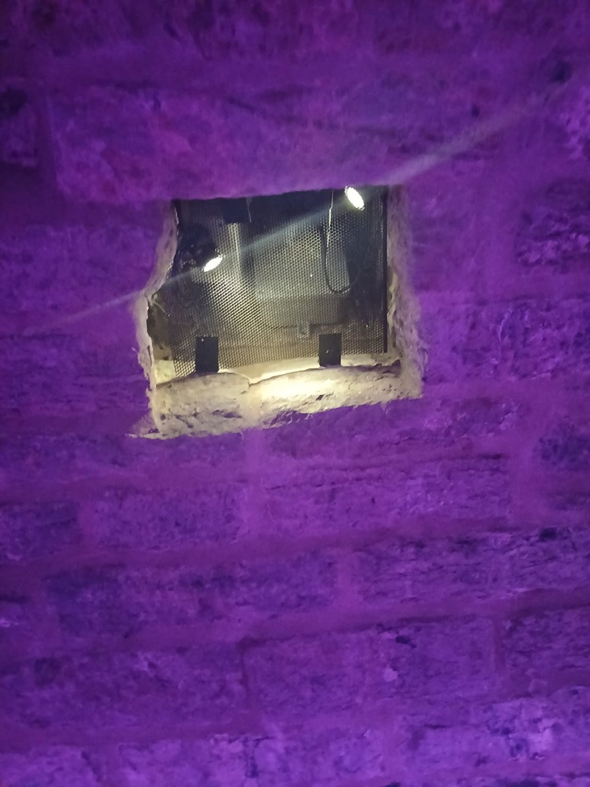

# Collecteur de mémoires
## Point à callière

> Type d'exposition : permanente et intérieure.
### Date de visite
Le 21 février 2026.

## Titre de l'oeuvre
Le premier égout collecteur.

### Firme et année de réalisation
L'installation a été créée le 17 mai 2017 pour le 375e anniversaire de Montréal et la firme qui l'a créée est Moment Factory, mais l'égout-même existe depuis les années 1800'.

### Description de l'oeuvre

Le premier égout collecteur est une installation visant à mettre en valeur ce grand égout qui a été construit entre 1832 et 1838. Auparavant, il a servi à la canalisation des eaux de la Petite rivière, puis a filtré l'eau d'une autre rivière.

Type d'installation : Elle est contemplative et un peu immersive. On ne peut qu'observer, rien toucher, mais  il y a quand même une atmosphère établie.

## Fonction du dispositif multimédia 
La fonction de cette oeuvre est vraiment la mise en valeur. L'intention derrière cette installation est de dévoiler au public une infrastructure historique qui servait à l'époque, rien de plus.

## Croquis

-

## Composantes et techniques

- Système d'éclairage LED
- Audio Spatialisé
- Projecteurs

## Éléments nécessaires à la mise en exposition
1. La structure métallique en bas qui donne une meilleur facon d'acceder et marcher a travers l'égout et en meme temps protege le sol original.
2. Le cables sont bien dissimulé afin que l'expérience soiot pleine et parfaite.
3. Le système de ventilation qui empêche l'humidité de gacher l'expérience.

## Expérience vécue
Cette expérience a été très intriguante ce qui est la raison pourquoi je l'ai choisi. Dès que je suis rentré dans l'installation, plusieurs détails a attirer mes yeux ; les lumières LED, les quelques projections, d'autres passages de de l'égout qui me faisait me poser plusieurs questions comme, sa ressemble à quoi là-dedans et etc.

### Ce qui m'a plu
Ce que j'ai bien plu était l'ambiance. En dirais vraiment que j'étais dans un égout fonctionnel. Aussi, l'égout avait l'air intact et sa à piqué encore plus ma curiosité. Je trouve qu'ils ont bien fait de garder l'apparence initial de l'égout et de l'avoir parfaitement conserver et c'est impressionnant à mon avis.

## Aspect que je ne souhaite pas retenir
Je pense qu'un aspect que je ne souhaite retenir est le manque d'information sur l'égout. Quand je suis allé, j'attendais à ce qu'il est un cartel où son histoire serait raconter. Malheureusement, rien et j'ai du consulter la page du musée afin de trouver cette information ce que je pense est dommage.

# Références 
- [Point à callière photo](https://www.tourbytransit.com/montreal/things-to-do/Museum-of-Archaeology-and-History)
- [informations sur l'égout](https://pacmusee.qc.ca/fr/expositions/detail/collecteur-de-memoires/)
